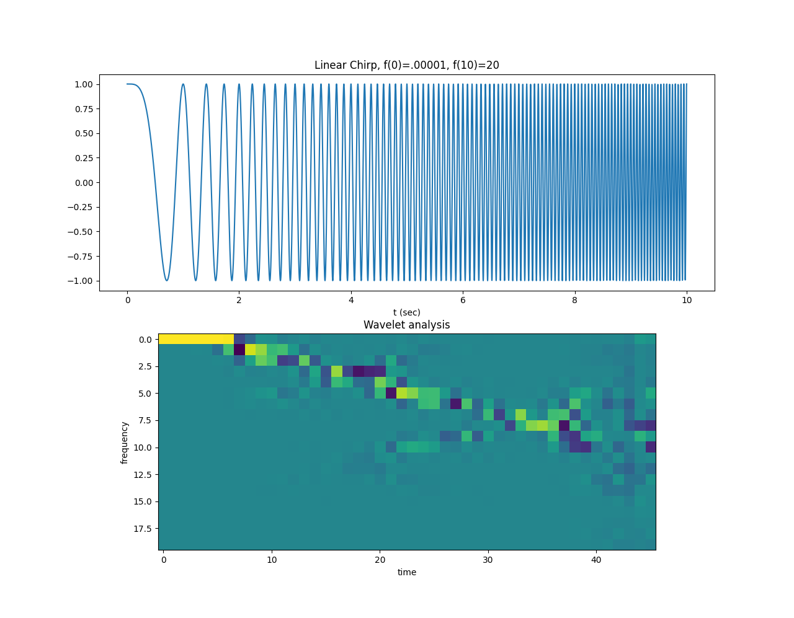

jaxlets
=======
Differentiable and gpu enabled fast wavelet transforms in jax. 

Features
--------
- 1d forward and backward fwt are implemented in `src/jaxlets/conv_fwt.py`.
- 2d forward and backard fwt methods are part of the `src/jaxlets/conv_fwt_2d.py` module.

Installation
------------
Head to https://github.com/google/jax#installation and follow the procedure described there, then do the 
following to install the code in development mode:

.. code-block:: sh

    $ git clone https://github.com/v0lta/jaxlets
    $ cd jaxlets
    $ pip install -e .

If you want it ready to go, do the following:

.. code-block:: sh

    $ git clone https://github.com/v0lta/jaxlets
    $ cd jaxlets
    $ pip install git+https://github.com/v0lta/jaxlets.git

If you aren't able to follow the JAX installation instructions, you can install it in CPU-only mode
using the `jax_cpu` extra. This means you have to use development mode and install like this:

.. code-block:: sh

    $ git clone https://github.com/v0lta/jaxlets
    $ cd jaxlets
    $ pip install -e .[jax_cpu]

Usage Example
-------------

.. code-block:: python

    import pywt
    import jax.numpy as np
    from jaxlets.packets import WaveletPacket
    import matplotlib.pyplot as plt
    import scipy.signal as signal
    t = np.linspace(0, 10, 5001)
    wavelet = pywt.Wavelet('db4')
    w = signal.chirp(t, f0=.00001, f1=20, t1=10, method='linear')

    wp = WaveletPacket(data=w,
                       wavelet=wavelet,
                       mode='reflect')
    nodes = wp.get_level(7)
    np_lst = []
    for node in nodes:
        np_lst.append(wp[node])
    viz = np.stack(np_lst)

    fig, axs = plt.subplots(2)
    axs[0].plot(t, w)
    axs[0].set_title("Linear Chirp, f(0)=.00001, f(10)=20")
    axs[0].set_xlabel('t (sec)')

    axs[1].set_title("Wavelet analysis")
    axs[1].imshow(viz[:20, :])
    axs[1].set_xlabel('time')
    axs[1].set_ylabel('frequency')
    plt.show()

In the above example the increasing frequency of a chirp signal is visualized
using wavelet packets, the expected output is shown below: 

Testing
-------
Unit tests are handled by ``tox``. Clone the repository and run it with the following:

.. code-block:: sh

    $ pip install tox
    $ git clone https://github.com/v0lta/jaxlets
    $ cd jaxlets
    $ tox

Test outputs can also be generated with ``tox -e plots``.

Goals
-----
- In the spirit of jax the aim is to be 100% pywt compatible. Whenever possible, interfaces should be the same
  results identical.

Coming up
---------
- Interface improvements
- Extended jit support.

Feedback
--------
This is an early release, if you have questions, suggestions or run into issues, please open an issue.
